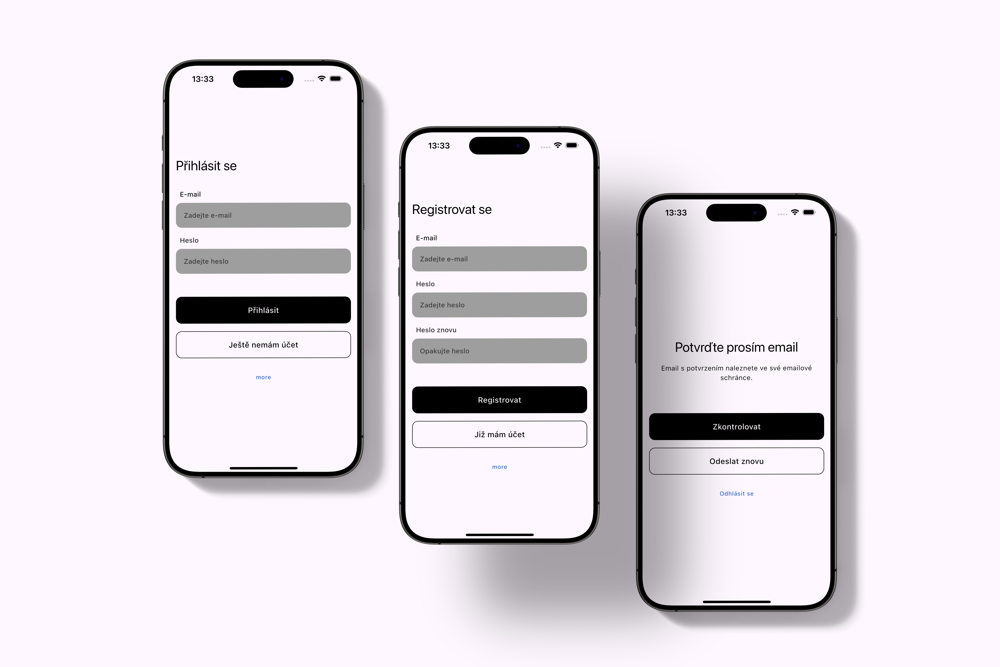

<!--
This README describes the package. If you publish this package to pub.dev,
this README's contents appear on the landing page for your package.

For information about how to write a good package README, see the guide for
[writing package pages](https://dart.dev/guides/libraries/writing-package-pages).

For general information about developing packages, see the Dart guide for
[creating packages](https://dart.dev/guides/libraries/create-library-packages)
and the Flutter guide for
[developing packages and plugins](https://flutter.dev/developing-packages).
-->

# Firebase Auth Flow

Flutter widget package for handling a Firebase Authentication Flow.



## Getting started

- Add Firebase Auth Flow's `localizationsDelegates` to your `MaterialApp`'s ones,
- make sure that app's supported locales are also `firebase_auth_flow`'s supported locales. If not, contribute to Firebase Auth Flow, please.

<details>
<summary>Get localization work!</summary>

``` dart
import 'package:firebase_auth_flow/l10n/app_localizations.dart'
    as firebase_auth_flow;

class App extends StatelessWidget {
  const App({super.key});

  @override
  Widget build(BuildContext context) {
    return MaterialApp.router(
      title: Flavors.title,
      localizationsDelegates: _localizationsDelegates,
      supportedLocales: _supportedLocales,
      theme: ThemeData(
        primarySwatch: Colors.blue,
      ),
      routerConfig: appRouter,
    );
  }

  Iterable<LocalizationsDelegate<dynamic>>? get _localizationsDelegates => [
        ...AppLocalizations.localizationsDelegates,
        ...firebase_auth_flow.AppLocalizations.localizationsDelegates,
      ];

  Iterable<Locale> get _supportedLocales {
    // Make sure app's supported locales are also firebase_auth_flow's supported locales
    for (final loca in AppLocalizations.supportedLocales) {
      if (!firebase_auth_flow.AppLocalizations.supportedLocales
          .contains(loca)) {
        throw UnsupportedError(
          "Not all app's supported locales are also firebase_auth_flow's supported locales. Head to firebase_auth_flow's doc.",
        );
      }
    }
    return AppLocalizations.supportedLocales;
  }
}
```

</details>

### FirebaseAuthFlowProvider

- `email`.

### FirebaseAuthFlowDependencies

- `provider` => The type of authentication provider,
- `activityIndicator` => Widget that indicates some activity,
- `loginAboutText` => String navigating to help/support,
- `onLoginAboutTextPressed` => action for the help/support,
- `onPrivacyPolicyPressed` => action for providing privacy policy view,
- `onLoginPressed` => action for logging in,
- `onRegisterPressed` => action for registration,
- `onCheckVerificationPressed` => action for checking if email address is verified,
- `onResendVerificationPressed` => action for sending email verification,
- `onLogoutPressed` => action for logout,
- `onLoggedIn` => callback when user logs in,
- `onLoggedOut` => callback when user logs out,
- `disabledOpacity` => opt. opacity of disabled,
- `borderRadius` => opt. border radius,
- `colorPrimary` => opt. primary color,
- `colorOnSecondary` => opt. on secondary color,
- `colorAbout` => opt. color of `loginAboutText`,
- `colorError` => opt. Error sanck bar color,
- `colorSuccess` => opt. Success snack bar color.

### FirebaseAuthFlowState

- `login` => login page,
- `emailVerification` => email verification page.

## Firebase Auth Flow Usage

``` dart
final FirebaseAuthFlowState firebaseAuthFlowState;

// create Firebase Auth Flow state
if (FirebaseAuth.instance.currentUser?.emailVerified == null) {
    firebaseAuthFlowState = FirebaseAuthFlowState.login;
} else {
    firebaseAuthFlowState = FirebaseAuthFlowState.emailVerification;
}

return FirebaseAuthFlow(
           FirebaseAuthFlowDependencies(
               provider: FirebaseAuthFlowProvider.email,
               activityIndicator: const PlatformActivityIndicator(),
               loginAboutText: 'About',
               onLoginAboutTextPressed: () {}, // navigate to "about" screen
               onPrivacyPolicyPressed: () {}, // navigate to privacy policy screen
               onLoginPressed: AuthenticationHelper().login,
               onRegisterPressed: AuthenticationHelper().registerEmail,
               onCheckVerificationPressed: AuthenticationHelper().checkEmailVerification,
               onResendVerificationPressed: AuthenticationHelper().resendEmailVerification,
               onLogoutPressed: AuthenticationHelper().logout,
               onLoggedIn: () => {}, // action after user is logged in
               onLoggedOut: () => {}, // action after user is logged out
           ),
          state: firebaseAuthFlowState,
);
```

<details>
<summary>AuthenticationHelper() example</summary>

``` dart

class AuthenticationHelper {
  factory AuthenticationHelper() {
    return _authenticationHelper;
  }

  AuthenticationHelper._internal();
  static final AuthenticationHelper _authenticationHelper =
      AuthenticationHelper._internal();

  User? get user => FirebaseAuth.instance.currentUser;
  bool? get isEmailVerified => user?.emailVerified;

  Future<void> registerEmail({
    required String email,
    required String password,
    required void Function({String? errorCode}) onRegisterDone,
  }) async {
    try {
      await _createFirebaseAccount(
        email: email,
        password: password,
      );
      await _sendEmailVerification();
      onRegisterDone();
    } catch (errorCode) {
      onRegisterDone(
        errorCode: errorCode.toString(),
      );
    }
  }

  Future<void> login({
    required String email,
    required String password,
    required void Function({String? errorCode, bool? isEmailVerified})
        onLoginDone,
  }) async {
    try {
      await _signIntoFirebase(email: email, password: password);
      onLoginDone(isEmailVerified: isEmailVerified);
    } catch (errorCode) {
      onLoginDone(
        errorCode: errorCode.toString(),
      );
    }
  }

  Future<void> logout({
    required void Function({String? errorCode}) onLogoutDone,
  }) async {
    try {
      await FirebaseAuth.instance.signOut();
      await user?.reload();
      Logging.log.info('$runtimeType -> logOut: logged out');
      onLogoutDone();
    } catch (errorCode, stackTrace) {
      Logging.log.severe(
        '$runtimeType -> logOut: ${errorCode.toString()}',
        errorCode,
        stackTrace,
      );
      onLogoutDone(
        errorCode: errorCode.toString(),
      );
    }
  }

  Future<void> checkEmailVerification({
    required void Function({String? errorCode, bool? isEmailVerified})
        onCheckDone,
  }) async {
    try {
      await user?.reload();
      if (isEmailVerified != true) {
        Logging.log.info(
          '$runtimeType -> checkEmailVerification: email is not verified',
        );
        onCheckDone(errorCode: FirebaseAuthFlowError.emailNotVerified.code);
      } else {
        Logging.log.info(
          '$runtimeType -> checkEmailVerification: email is verified',
        );
        onCheckDone(isEmailVerified: true);
      }
    } catch (errorCode, stackTrace) {
      Logging.log.severe(
        '$runtimeType -> checkEmailConfirmation: ${errorCode.toString()}',
        errorCode,
        stackTrace,
      );
      onCheckDone(
        errorCode: errorCode.toString(),
      );
    }
  }

  Future<void> resendEmailVerification({
    required void Function({String? errorCode}) onResendDone,
  }) async {
    try {
      await _sendEmailVerification();
      Logging.log.info(
        '$runtimeType -> resendEmailConfirmation: email confirmation resent',
      );
      onResendDone();
    } catch (errorCode, stackTrace) {
      Logging.log.severe(
        '$runtimeType -> resendEmailConfirmation: ${errorCode.toString()}',
        errorCode,
        stackTrace,
      );
      onResendDone(
        errorCode: errorCode.toString(),
      );
    }
  }

  Future<void> _sendEmailVerification() async {
    final currentUser = user;

    if (currentUser != null && !currentUser.emailVerified) {
      await currentUser.sendEmailVerification();
      await user?.reload();
      Logging.log.info('$runtimeType -> sendEmailVerification: sent');
    } else {
      return Future.error(FirebaseAuthFlowError.userLoggedOut.code);
    }
  }

  Future<void> _createFirebaseAccount({
    required String email,
    required String password,
  }) async {
    try {
      await FirebaseAuth.instance.createUserWithEmailAndPassword(
        email: email,
        password: password,
      );
      await user?.reload();
      Logging.log.info('$runtimeType -> _createFirebaseAccount: created');
    } on FirebaseAuthException catch (e, stackTrace) {
      Logging.log.severe(
        '$runtimeType -> _createFirebaseAccountOut: ${e.toString()}',
        e,
        stackTrace,
      );
      return Future.error(e.code);
    } catch (e, stackTrace) {
      Logging.log.severe(
        '$runtimeType -> _createFirebaseAccountOut: ${e.toString()}',
        e,
        stackTrace,
      );
      return Future.error(FirebaseAuthFlowError.universal.code);
    }
  }

  Future<void> _signIntoFirebase({
    required String email,
    required String password,
  }) async {
    try {
      await FirebaseAuth.instance
          .signInWithEmailAndPassword(email: email, password: password);
      await user?.reload();
      Logging.log.info('$runtimeType -> _signIntoFirebase: signed in');
    } on FirebaseAuthException catch (e, stackTrace) {
      Logging.log.severe(
        '$runtimeType -> _signIntoFirebase: ${e.toString()}',
        e,
        stackTrace,
      );
      return Future.error(e.code);
    } catch (e, stackTrace) {
      Logging.log.severe(
        '$runtimeType -> _signIntoFirebase: ${e.toString()}',
        e,
        stackTrace,
      );
      return Future.error(FirebaseAuthFlowError.universal.code);
    }
  }
}
```

</details>

## Contribution

### build runner

`flutter packages pub run build_runner build --verbose --delete-conflicting-outputs`

### loca gen

`flutter gen-l10n`
